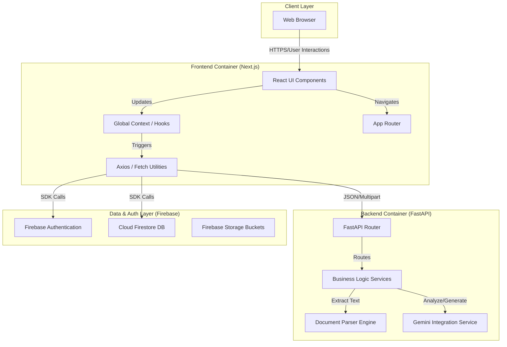
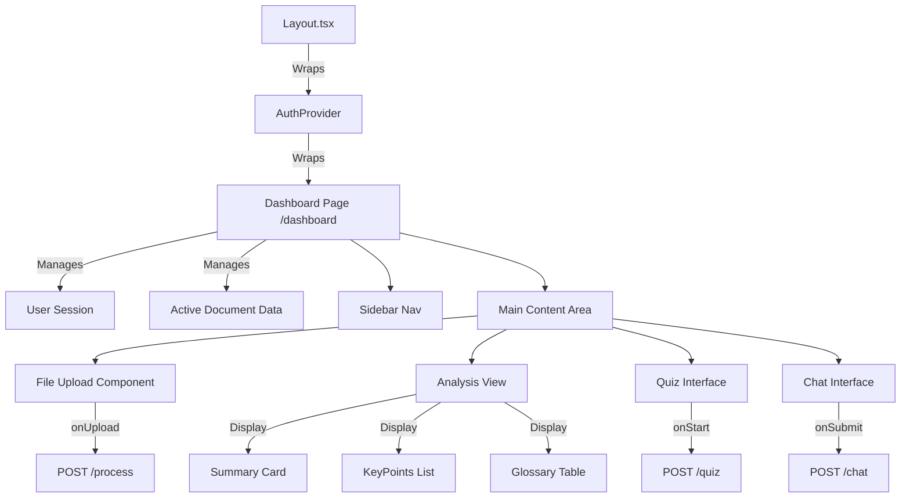
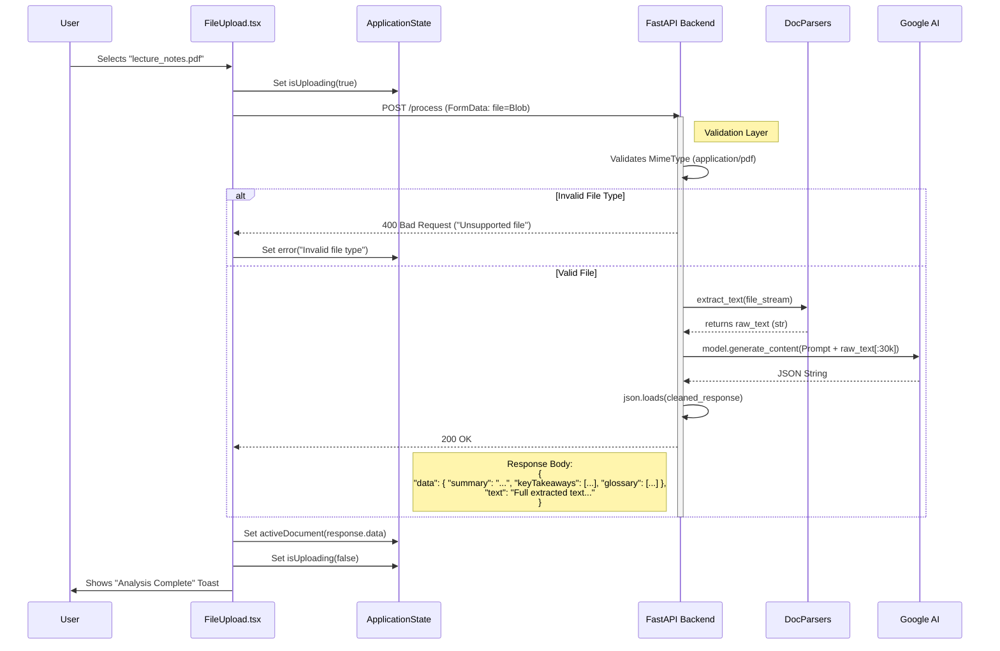
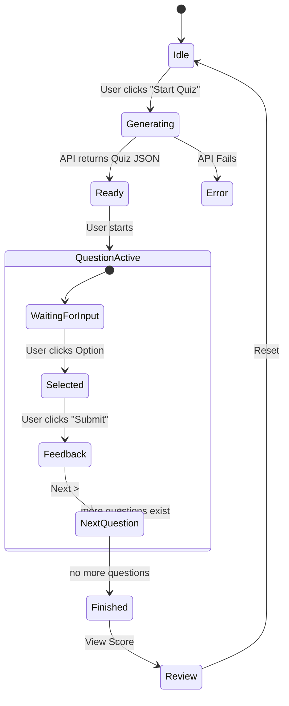
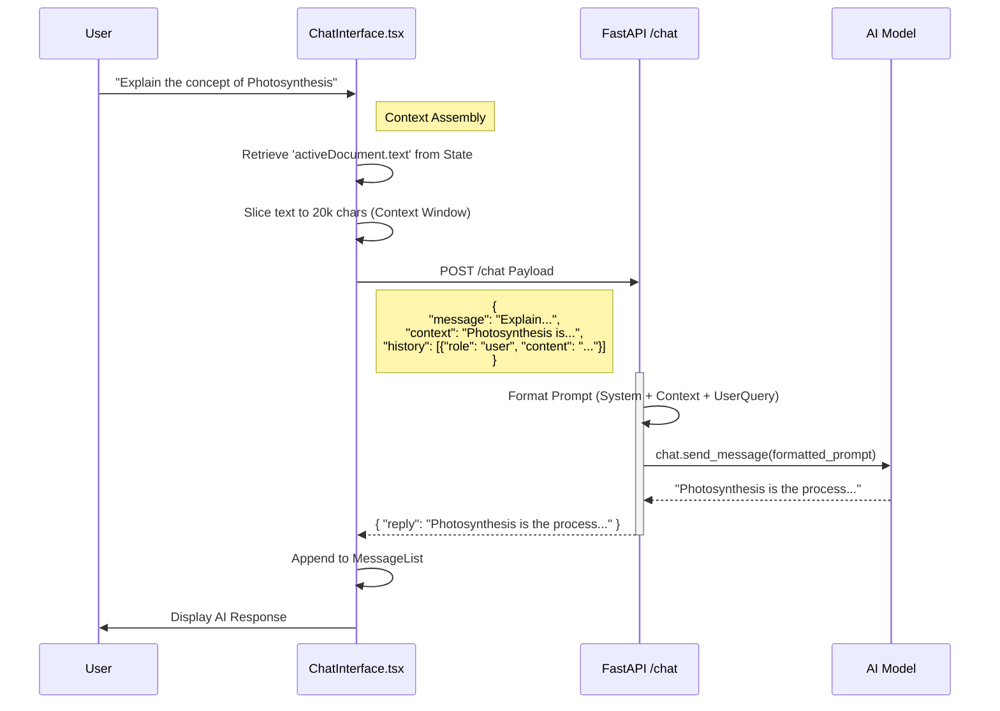
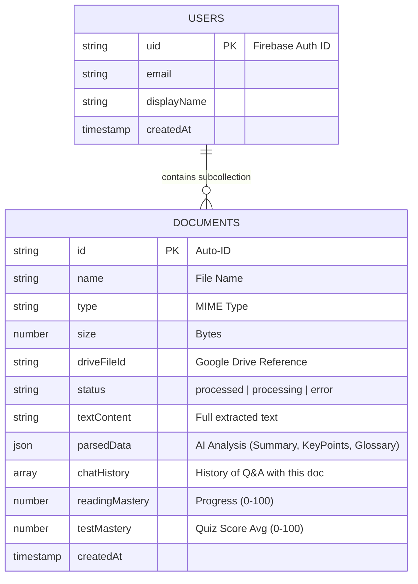
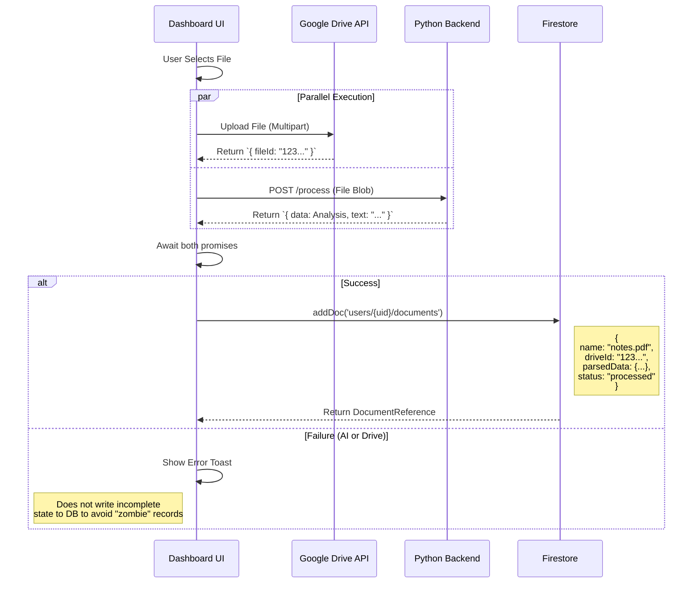
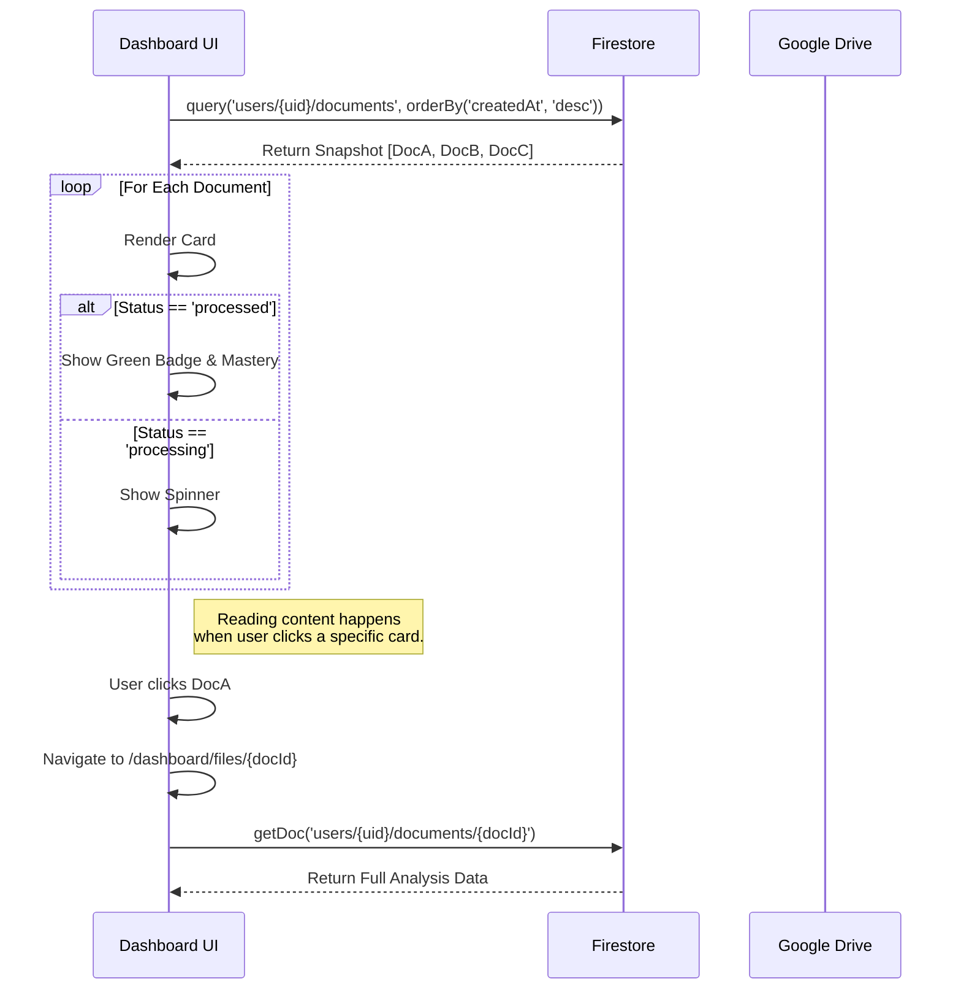

# EduMate AI - Deep Dive Architecture & Interaction Models

This document provides a highly detailed technical breakdown of the EduMate AI platform. It covers component-level interactions, data structures, state management, and comprehensive interaction flows.

## 1. System Context & Container Diagram

The following diagram illustrates the high-level containers and their responsibilities within the EduMate AI ecosystem.



---

## 2. Component Architecture (Frontend)

The frontend is structured using a component-based architecture. A central `ProjectContext` or specific hooks manage the state of the active document, quiz progress, and chat history.

### 2.1 Component Tree & Data Flow



---

## 3. Detailed Interaction Flows

### 3.1. File Upload & Analysis Pipeline (Detailed Attributes)

This flow details the exact data attributes passed during the upload process, including error handling.



### 3.2. Quiz Session State Machine

The Quiz component operates as a finite state machine.



### 3.3. RAG-Lite Chat Interaction (Retrieval Augmented Generation)

The chat system sends context window snippets to Gemini to simulate memory of the document.



---

## 4. Backend Data Models (Pydantic)

These models define the strict contracts for API communication (FastAPI).

### 4.1. Document Analysis Response
```python
class AnalysisResult(BaseModel):
    basic: LevelInsights
    intermediate: LevelInsights
    advanced: LevelInsights
    glossary: List[GlossaryTerm]

class LevelInsights(BaseModel):
    summary: str
    keyTakeaways: List[str]

class GlossaryTerm(BaseModel):
    term: str
    definition: str
```

### 4.2. Quiz Generation
```python
class QuizRequest(BaseModel):
    text: str
    mode: str = "intermediate" # 'basic' | 'intermediate' | 'advanced'

class QuizQuestion(BaseModel):
    question: str
    options: List[str] # Array of 4 strings
    answer: str # Exact string match from options based on UI implementation
```

### 4.3. Chat Interface
```python
class ChatMessage(BaseModel):
    role: str # 'user' | 'model'
    content: str
    
class ChatRequest(BaseModel):
    message: str
    context: Optional[str] = None
    history: List[ChatMessage] = []
```

---

## 5. Database Schema (Firestore)

The application uses a **NoSQL** document model with a subcollection architecture to organize user data.



---

## 6. Infrastructure & Deployment View

```mermaid
graph LR
    subgraph "Production Environment"
        Verifier[Vercel (Frontend)]
        Renderer[Render/Cloud Run (Backend)]
        DB[Firebase Firestore]
    end
    
    Dev[Developer Laptop] -->|git push| GitHub
    GitHub -->|Webhook| Verifier
    GitHub -->|Webhook| Renderer
    
    Verifier -->|Connects to| Renderer
    Verifier -->|Connects to| DB
```

## 7. Error Handling Strategies

| Service | Failure Mode | Fallback Strategy | User Feedback |
| :--- | :--- | :--- | :--- |
| **Gemini AI** | Rate Limit (429) | Exponential Backoff (Retry 3x) | "AI is busy, retrying..." |
| **Gemini AI** | Content Filter | Return specific error code | "Content filtered for safety." |
| **File Parser** | Corrupt PDF | Abort parsing | "File appears corrupted." |
| **Backend** | Timeout (504) | Client-side timeout (30s) | "Processing took too long." |

---

## 8. Database Interaction Strategy

The application employs a hybrid data strategy, utilizing **Firebase Firestore** for structured metadata and analysis results, and **Google Drive** for raw file storage/backup. This ensures fast application performance while leveraging the user's personal cloud storage for large files.

### 8.1. Data Persistence Models

#### **Firestore (Document Store)**
Acts as the primary source of truth for the application state. It stores:
- File Metadata (Name, Size, Type)
- Processing Status (`processing`, `processed`, `error`)
- AI Generated Content (Summary, Key Takeaways, Quiz Data)
- Sync Status with Google Drive

#### **Google Drive (Blob Store)**
Used for persistent storage of the original raw files (PDFs, DOCX, etc.). This avoids high bandwidth costs on our end and gives users ownership of their data.

### 8.2. Write Operations: The "Upload Transaction"

The upload process is a complex multi-step transaction that ensures data consistency across the Client, Google Drive, Backend AI, and Firestore.



### 8.3. Read Operations: Real-time Synchronization

The dashboard relies on efficient querying to load user content.


